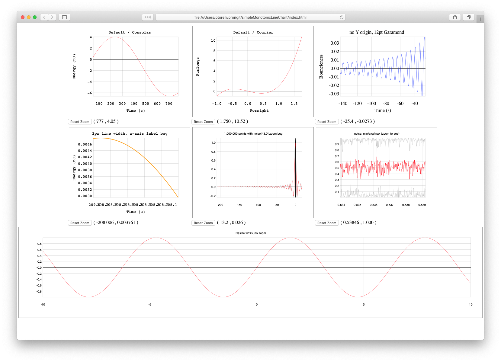

# Motiviation

It is amazing how badly just about every charting library fails when the number
of points exceeds 10,000. My applications demand 300x that. This is the
simplest, fastest way to render charts in JavaScript + HTML5 that I've found
to handle a huge number of points and still be responsive on PC & Mac hardware
from at least 2013.

# How it works

It's a strip chart. This means the difference on the x-axis between any two
adjacent points is always the same, `this.xstep`. This provides a lot of
optimization room.

In the HTML, create an empty DIV with an ID and pass that ID to the constructor
with new, e.g. `let chart = new StripChart(elementId)`.

Then use `StripChart.setData` to pass in the `xstep`, an `Float32Array`, and an
optional `xstart` if you want the x-axis to start at a negative number. Lastly,
call `StripChart.draw()`.

# Extras

If you create a DIV with ID set to `"chart ID"-controls`, the constructor will
look for three DOM object classes under that node: `xcoord`, `ycoord`, and
`reset`. The first
two will have their `.innerHTML` field updated if the mouse moves in the chart
DIV with a formated x- or y- coordinate. The `reset` element will have an
event listener attached to it which responds to `click` events. The presence
of this element will enable zooming by clicking on the chart, and resetting
the chart by clicking on the `reset` element. Only the first instance of each
class is used under the chart DIV.

# Zooming

A single click on the chart area turns the cursor into a spyglass and an zoom
rectangle will now follow the cursor position until the user clicks again or
leaves the chart area. The second click updates the display window to that
zoomed region. Clicking the `reset` class object (see above) will reset the
zoom to show the entire dataset. Zooming is disabled if there is no `reset`
class element.

# Subsampling

If there is more data than pixels in the chart width, subsampling occurs. This
results in three lines being rendered: min, avg, and max of the viewable range.
These lines vanish once the zoom range is back to <=1 sample per pixel.

# Properties

A few HTML properties are exposed, see `initializeProperties` for more details.

# TODO

1. auto-anti-scrunch tics based on font and plot size (what Gnuplot tried to fix back in the day)
2. More Map() parameters
3. custom tic ranges
